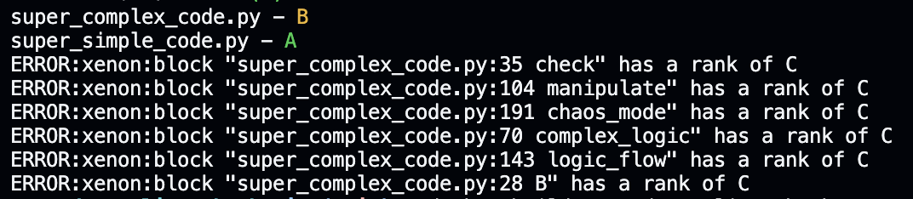

# 👨🏻‍💻 Code Quality Checker with Radon and Xenon

This repository uses Radon and Xenon to analyze code complexity and maintainability. These tools help ensure your code is readable, maintainable, and within specified complexity limits.

## ✅ Features

- Radon for cyclomatic complexity (CC) and maintainability index (MI).
- Xenon for enforcing complexity thresholds.
- Runs checks both locally and in CI/CD pipelines with GitHub Actions.

### 👇 For context on how these metrics work, you can read this blog post:

[👀 How to fix your Python code with Radon & Xenon before it's too late](https://thepipeandtheline.substack.com/p/how-to-fix-your-python-code-with-radon-and-xenon
)

## Setup Instructions

### 1. 👨🏻‍💻 Running Locally

Requirements: python >= 3.9 & pip

- Install Dependencies:
   
```sh
pip install radon xenon
```
    
- Cyclomatic Complexity (CC) Check:
    
```sh
radon cc ./ -s
```
    
- Maintainability Index (MI) Check:
    
```sh
radon mi ./
```
    
- Xenon Complexity Enforcement:
    
```sh
xenon --max-absolute B ./
```
This is how the result should look like:



### 2. 📦 Using Docker

Requirements: Docker Desktop

```sh
docker build -t code-quality-checker .
docker run -t code-quality-checker
```

### 3. 🔂 GitHub Actions Integration

Requirements: Github repo

This repository includes a GitHub Actions workflow that automatically checks the code quality when a pull request is opened or updated on the main branch.

GitHub Actions Workflow ``.github/workflows/code-quality.yml``

Once the checks are completed, you'll see the results directly in the GitHub pull request under the "Checks" tab.

There's a [sample pull request](https://github.com/aboyalejandro/code_quality_check/pull/1) to check the outcome.

## 🔥 Fixing the code with CursorAI

Cursor is an AI-powered code editor that can help you fix your code by adding comments, suggestions, and even whole functions and classes.

You can paste the code into Cursor and it will give you a summary of the code and suggestions on how to improve it. There are some [screenshots](https://github.com/aboyalejandro/code-quality-check/tree/main/screenshots) on this repo for you to check how it works.

### 😎 [Follow me on Linkedin](https://www.linkedin.com/in/alejandro-aboy/)
- Get tips, learnings and tricks for your Data career!

### 📩 [Subscribe to The Pipe & The Line](https://thepipeandtheline.substack.com/?utm_source=github&utm_medium=referral)
- Join the Substack newsletter to get similar content to this one and more to improve your Data career!
